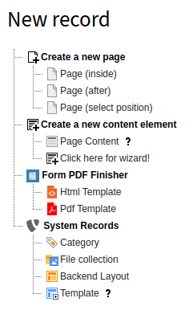
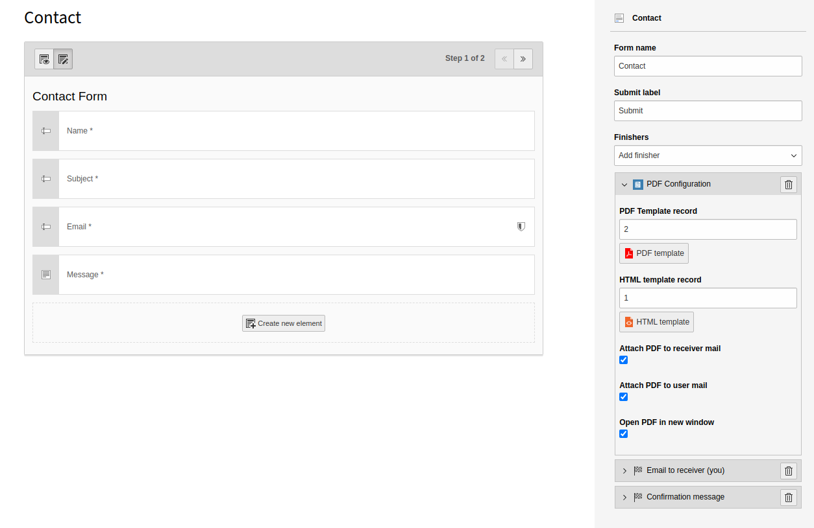

# Form PDF Finisher / form_pdf
[](https://packagist.org/packages/t3brightside/form-pdf)
[](LICENSE)
[](https://t3brightside.com)

**TYPO3 form finisher to write form data into pre-defined PDF file.**
- Sends PDF as an attachment in user and receiver e-mails
- Provides link to the PDF file in the confirmation message & deletes file after clicking the link
- Adds scheduler task to remove the file after certain amount of time if link is not clicked     

## Installation

Install with composer (recommended)
```bash
composer require t3brightside/form-pdf
```
- **v1.1.2** is composer only
- **v1.1.1** is available in TER but mPDF fonts have been removed from Resources/Private/PHP/mpdf/mpdf/ttfonts/
find the fonts here: https://github.com/t3brightside/form_pdf/tree/1.1.1/Resources/Private/PHP/mpdf/mpdf/ttfonts
or grab the package and install it manually: https://github.com/t3brightside/form_pdf/tree/1.1.1

### How it works

The PDF file is generated using [mPDF PHP library](https://mpdf.github.io/).

It uses pre-defined PDF Template file as layout and inserts pre-defined HTML with form data and layout.

#### PDF Template

It is possible to prepare PDF layout with office software.  
You can find [PDF layout example here](./Documentation/example/layout.pdf).

#### HTML Template

HTML template contains fluid-styled markers of form values.  
You can find [HTML example here](./Documentation/example/values.html).  
This example related to default contact form.

## Usage

1. Include static record "Form PDF" to TS template.

2. Prepare 2 records: PDF Template, HTML templates.

  

3. Add PDF Finisher at the first position in the form.

  

4. Select already created PDF Template and HTML Template.

5. "Attach PDF to receiver mail": when checked, then PDF is attached to admin mail.

6. "Attach PDF to user mail": when checked, then PDF is attached to user mail.

7. "Open PDF in new window": when checked, the confirmation message is appended with "Click to open PDF." link.

8. When the link "Click to open PDF." is clicked, then PDF is removed from filesystem.

## For Developer

### Templating

Confirmation template is `ConfirmationWithLink.html`.  
It is possible to rewrite it from another location by configuration
```yaml
TYPO3:
    CMS:
        Form:
            prototypes:
                standard:
                    finishersDefinition:
                        Confirmation:
                            options:
                                templateRootPaths:
                                   20: 'fileadmin/templates/form/Confirmation/'

```

### Extending
It extends core finishers
* EmailFinisher.php
* ConfirmationFinisher.php

## Sources

- [GitHub](https://github.com/t3brightside/form_pdf)
- [Packagist](https://packagist.org/packages/t3brightside/form-pdf)
- [TER](https://extensions.typo3.org/extension/form_pdf/)

## Author
[Mykola Orlenko](https://github.com/okolya) - [mykola.orlenko@web-spectr.com](mailto:mykola.orlenko@web-spectr.com)

## Development and maintenance

[Brightside OÜ – TYPO3 development and hosting specialised web agency](https://t3brightside.com/)